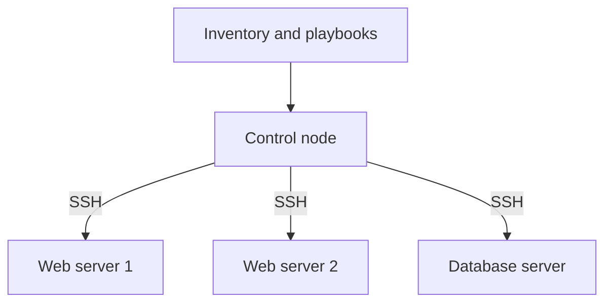

# Ansible for DevOps — Student Guide

Welcome to the **Ansible** section of the CDEC DevOps Learning repository.

Ansible is an automation tool used to configure servers, deploy applications, and perform repeatable administration tasks. This guide begins with the fundamentals and ends with a practical multi-server project.

> **Important:** Practise in a lab account or disposable virtual machines. Review cloud pricing, restrict network access, and stop or delete resources when they are no longer needed.

---

## Learning Outcomes

After completing this section, students should be able to:

- Explain configuration management and Ansible architecture
- Configure secure SSH access between Linux machines
- Build and validate an Ansible inventory
- Run ad hoc commands and gather facts
- Write idempotent YAML playbooks
- Use variables, templates, conditions, loops, and handlers
- Organize automation with roles and collections
- Protect sensitive variables with Ansible Vault
- Test changes with syntax check, check mode, and diff mode
- Diagnose common inventory, SSH, Python, and privilege errors

---

## 1. What Is Configuration Management?

Configuration management keeps systems in a defined and repeatable state.

Without automation, an administrator may log in to every server and run the same commands manually. This approach is slow, inconsistent, and difficult to audit. With Ansible, the desired configuration is written as code and applied to one or many systems.

Common use cases include:

- Installing and updating packages
- Managing users, files, and permissions
- Configuring web servers and databases
- Deploying applications
- Restarting services only when configuration changes
- Applying the same configuration across environments

### Ansible and Terraform

| Tool | Main purpose | Typical example |
|---|---|---|
| Terraform | Provision infrastructure | Create a VPC, EC2 instances, and a load balancer |
| Ansible | Configure systems and applications | Install Nginx and deploy its configuration |

They are complementary tools. Terraform can create servers, and Ansible can configure those servers.

---

## 2. Ansible Architecture

Ansible normally uses an **agentless** model. It is installed on a control node and connects to Linux managed nodes, usually over SSH.



### Important Terms

| Term | Meaning |
|---|---|
| Control node | Machine from which Ansible commands run |
| Managed node | Machine configured by Ansible |
| Inventory | Hosts and groups managed by Ansible |
| Module | Reusable unit that performs an action |
| Task | One module invocation with arguments |
| Play | Tasks applied to a host group |
| Playbook | YAML file containing one or more plays |
| Fact | Information discovered about a managed node |
| Handler | Task triggered only when notified by a changed task |
| Role | Standard directory structure for reusable automation |
| Collection | Distributed package of modules, plugins, roles, or playbooks |

Use the terms **control node** and **managed node**. “Master” and “worker” are not accurate descriptions of Ansible's normal architecture.

---

## 3. Lab Requirements

For the first lab, create two Ubuntu machines:

- One Ansible control node
- One managed node called `web1`

You can add `web2` after the first connection succeeds.

Requirements:

- Python 3 on the control node
- Python on managed Ubuntu nodes
- SSH connectivity from the control node to managed nodes
- A user such as `ubuntu` with appropriate `sudo` permission
- Private network connectivity or carefully restricted public access

### Network Safety

- Allow SSH only from a trusted source or from the control node.
- Never expose SSH to the whole internet unless a short-lived lab specifically requires it.
- Prefer private IP addresses when all machines are in the same VPC or private network.
- Do not store private keys or cloud credentials in GitHub.

---

## 4. Install Ansible on the Control Node

Installation commands can change between operating-system and Ansible releases. Check the current official installation guide before installing.

For an Ubuntu learning machine, one common method is:

```bash
sudo apt update
sudo apt install -y software-properties-common
sudo add-apt-repository --yes --update ppa:ansible/ansible
sudo apt install -y ansible
```

Verify the installation:

```bash
ansible --version
ansible-playbook --version
ansible-galaxy --version
```

> Install Ansible only on the control node for this Linux SSH lab. Managed nodes normally do not need an Ansible agent.

---

## 5. Configure SSH Access

### Generate a Dedicated Key Pair

Run this on the control node:

```bash
ssh-keygen -t ed25519 -a 100 -f ~/.ssh/ansible_lab
```

This creates:

- `~/.ssh/ansible_lab` — private key; never share or commit it
- `~/.ssh/ansible_lab.pub` — public key; safe to install on a managed node

If password-based SSH is temporarily available, install the public key with:

```bash
ssh-copy-id -i ~/.ssh/ansible_lab.pub ubuntu@10.0.1.10
```

Cloud instances may instead receive the public key during provisioning. The public key belongs in the managed user's `~/.ssh/authorized_keys` file.

Protect SSH files:

```bash
chmod 700 ~/.ssh
chmod 600 ~/.ssh/ansible_lab
```

Test SSH before testing Ansible:

```bash
ssh -i ~/.ssh/ansible_lab ubuntu@10.0.1.10
```

Verify a new server's host-key fingerprint through a trusted source before accepting it. Do not globally disable SSH host-key checking merely to hide connection errors.

---

## 6. Create an Ansible Project

Keep configuration, inventory, and playbooks inside a project instead of editing the system-wide `/etc/ansible/hosts` file.

```text
ansible-nginx/
├── ansible.cfg
├── inventories/
│   └── dev/
│       ├── hosts.yml
│       └── group_vars/
│           └── all.yml
├── playbooks/
│   └── nginx.yml
├── roles/
├── templates/
├── requirements.yml
├── .gitignore
└── README.md
```

Create the directories:

```bash
mkdir -p ansible-nginx/inventories/dev/group_vars
mkdir -p ansible-nginx/playbooks ansible-nginx/roles ansible-nginx/templates
cd ansible-nginx
```

### `ansible.cfg`

```ini
[defaults]
inventory = inventories/dev/hosts.yml
host_key_checking = True
retry_files_enabled = False
```

Because the configuration points to the project inventory, you do not need to edit `/etc/ansible/hosts`.

### `.gitignore`

```gitignore
*.retry
*.log
.vault-password
*.pem
*.key
```

Never add private keys or plaintext secrets to the repository.

---

## 7. Build the Inventory

Create `inventories/dev/hosts.yml`:

```yaml
---
all:
  children:
    webservers:
      hosts:
        web1:
          ansible_host: 10.0.1.10
        web2:
          ansible_host: 10.0.1.11
      vars:
        ansible_user: ubuntu
        ansible_ssh_private_key_file: ~/.ssh/ansible_lab
```

Replace the example addresses with your managed nodes' private IP addresses.

Validate the inventory:

```bash
ansible-inventory --graph
ansible-inventory --list
```

Test all managed nodes:

```bash
ansible all -m ansible.builtin.ping
```

The `ping` module is not an ICMP network ping. It checks whether Ansible can connect and execute Python on the managed node.

Expected result:

```text
web1 | SUCCESS => {
    "changed": false,
    "ping": "pong"
}
```

---

## 8. Ad Hoc Commands

Ad hoc commands are useful for quick, one-time operations.

Check uptime:

```bash
ansible webservers -m ansible.builtin.command -a "uptime"
```

Check disk usage:

```bash
ansible webservers -m ansible.builtin.command -a "df -h"
```

Gather facts:

```bash
ansible webservers -m ansible.builtin.setup
```

Install Nginx with privilege escalation:

```bash
ansible webservers --become \
  -m ansible.builtin.apt \
  -a "name=nginx state=present update_cache=true"
```

Use playbooks for repeatable configuration. Ad hoc commands are not a substitute for documented automation.

---

## 9. Your First Playbook

Create `playbooks/nginx.yml`:

```yaml
---
- name: Configure Nginx web servers
  hosts: webservers
  become: true
  gather_facts: true

  tasks:
    - name: Install Nginx
      ansible.builtin.apt:
        name: nginx
        state: present
        update_cache: true
        cache_valid_time: 3600

    - name: Create the student home page
      ansible.builtin.copy:
        dest: /var/www/html/index.html
        content: |
          <h1>CDEC Ansible Lab</h1>
          <p>Managed host: {{ inventory_hostname }}</p>
        owner: root
        group: root
        mode: "0644"
      notify: Reload Nginx

    - name: Ensure Nginx is enabled and running
      ansible.builtin.service:
        name: nginx
        state: started
        enabled: true

  handlers:
    - name: Reload Nginx
      ansible.builtin.service:
        name: nginx
        state: reloaded
```

Validate and run it:

```bash
ansible-playbook playbooks/nginx.yml --syntax-check
ansible-playbook playbooks/nginx.yml --check --diff
ansible-playbook playbooks/nginx.yml
```

Run it a second time:

```bash
ansible-playbook playbooks/nginx.yml
```

Ideally, the second run reports no unnecessary changes. This property is called **idempotence**.

### Why `state: present`?

`state: present` ensures the package is installed without upgrading it every time. `state: latest` can introduce unexpected version changes. Perform upgrades as a separate, reviewed activity.

### Why Use Fully Qualified Collection Names?

Names such as `ansible.builtin.apt` clearly identify which collection provides the module and avoid ambiguity.

---

## 10. Understanding Playbook Results

At the end of a run, Ansible displays a play recap:

| Result | Meaning |
|---|---|
| `ok` | Desired state was already present |
| `changed` | Ansible changed the managed node |
| `unreachable` | Connection or authentication failed |
| `failed` | A task ran but did not complete successfully |
| `skipped` | A condition prevented the task from running |
| `rescued` | A failed task was handled by a rescue block |

An unreachable host and a failed task are different problems. Troubleshoot them separately.

---

## 11. Variables and Facts

Create `inventories/dev/group_vars/all.yml`:

```yaml
---
web_package: nginx
web_service: nginx
web_document_root: /var/www/html
course_name: CDEC DevOps Learning
```

Use variables in a task:

```yaml
- name: Install the web package
  ansible.builtin.apt:
    name: "{{ web_package }}"
    state: present
```

Common variable locations include:

- Inventory variables
- `group_vars/` for a group
- `host_vars/` for one host
- Role defaults and role variables
- Playbook variables
- Extra variables passed with `-e`

Extra variables have high precedence. Do not use them casually to hide unclear variable design.

Useful facts include:

```yaml
{{ ansible_facts['distribution'] }}
{{ ansible_facts['hostname'] }}
{{ ansible_facts['default_ipv4']['address'] }}
```

Facts describe a machine at runtime. Do not publish sensitive system information in public output.

---

## 12. Jinja2 Templates

Templates create configuration files whose content changes according to variables or facts.

Create `templates/index.html.j2`:

```html
<!doctype html>
<html lang="en">
  <head>
    <meta charset="utf-8">
    <title>{{ course_name }}</title>
  </head>
  <body>
    <h1>{{ course_name }}</h1>
    <p>Server: {{ inventory_hostname }}</p>
    <p>Operating system: {{ ansible_facts['distribution'] }}</p>
  </body>
</html>
```

Deploy the template:

```yaml
- name: Deploy the Nginx home page
  ansible.builtin.template:
    src: ../templates/index.html.j2
    dest: "{{ web_document_root }}/index.html"
    owner: root
    group: root
    mode: "0644"
  notify: Reload Nginx
```

For larger projects, place templates inside a role instead of using `../` paths.

---

## 13. Handlers

A handler normally runs only when a task:

1. Reports `changed`
2. Uses `notify`

Handlers usually run once at the end of the play, even if several tasks notify the same handler.

```yaml
tasks:
  - name: Deploy Nginx configuration
    ansible.builtin.template:
      src: nginx.conf.j2
      dest: /etc/nginx/nginx.conf
      mode: "0644"
      validate: "nginx -t -c %s"
    notify: Reload Nginx

handlers:
  - name: Reload Nginx
    ansible.builtin.service:
      name: nginx
      state: reloaded
```

The `validate` command checks a temporary candidate file before Ansible replaces the live configuration.

---

## 14. Conditions, Loops, and Registered Results

### Condition

```yaml
- name: Install Nginx on Debian-family systems
  ansible.builtin.apt:
    name: nginx
    state: present
  when: ansible_facts['os_family'] == 'Debian'
```

### Loop

```yaml
- name: Install utility packages
  ansible.builtin.apt:
    name: "{{ item }}"
    state: present
  loop:
    - curl
    - unzip
    - git
```

Many package modules also accept a list, which can be more efficient:

```yaml
- name: Install utility packages
  ansible.builtin.apt:
    name:
      - curl
      - unzip
      - git
    state: present
```

### Register Output

```yaml
- name: Read Nginx version
  ansible.builtin.command: nginx -v
  register: nginx_version
  changed_when: false

- name: Display Nginx version
  ansible.builtin.debug:
    var: nginx_version.stderr
```

Use `changed_when` and `failed_when` only when you understand the command's return behavior. Incorrect conditions can hide real failures.

---

## 15. Tags, Limits, and Dry Runs

Run only one host:

```bash
ansible-playbook playbooks/nginx.yml --limit web1
```

Add tags:

```yaml
- name: Install Nginx
  ansible.builtin.apt:
    name: nginx
    state: present
  tags:
    - packages
    - nginx
```

Run selected tags:

```bash
ansible-playbook playbooks/nginx.yml --tags nginx
```

Preview supported changes:

```bash
ansible-playbook playbooks/nginx.yml --check --diff
```

Check mode is useful but not a guarantee: module support varies, and commands or external systems may not be fully simulated. Review the output before a real run.

---

## 16. Roles

Roles make automation easier to reuse and maintain.

Create a role:

```bash
ansible-galaxy role init roles/webserver
```

Typical structure:

```text
roles/webserver/
├── defaults/main.yml
├── files/
├── handlers/main.yml
├── meta/main.yml
├── tasks/main.yml
├── templates/
├── tests/
└── vars/main.yml
```

Use the role in a playbook:

```yaml
---
- name: Configure web servers with a role
  hosts: webservers
  become: true
  roles:
    - role: webserver
```

Put values that users are expected to override in `defaults/main.yml`. Keep tasks focused, named, and idempotent.

---

## 17. Collections and `requirements.yml`

Collections distribute Ansible content. Record external dependencies in `requirements.yml` and pin reviewed versions.

```yaml
---
collections:
  - name: community.general
    version: "10.7.0"
```

Install dependencies:

```bash
ansible-galaxy collection install -r requirements.yml
```

Before copying a version number into a real project, confirm that it exists and is appropriate for your installed Ansible version.

---

## 18. Protect Secrets with Ansible Vault

Do not place passwords, tokens, private keys, or secret values in plaintext YAML.

Create an encrypted variables file:

```bash
ansible-vault create inventories/dev/group_vars/vault.yml
```

Edit or view it:

```bash
ansible-vault edit inventories/dev/group_vars/vault.yml
ansible-vault view inventories/dev/group_vars/vault.yml
```

Run a playbook and enter the Vault password interactively:

```bash
ansible-playbook playbooks/nginx.yml --ask-vault-pass
```

Encrypt one value:

```bash
ansible-vault encrypt_string --name database_password
```

Important rules:

- Keep the Vault password separate from the repository.
- Never commit a plaintext password file.
- Vault protects data at rest; decrypted values can still leak through unsafe tasks or logs.
- Use `no_log: true` on tasks that could expose secrets, while remembering that it also hides useful debugging output.
- Prefer an approved secrets manager for larger production environments.

---

## 19. Privilege Escalation

Use `become: true` only for tasks that require elevated privileges.

```yaml
- name: Restart Nginx with privilege escalation
  become: true
  ansible.builtin.service:
    name: nginx
    state: restarted
```

For a lab account that requires a sudo password:

```bash
ansible-playbook playbooks/nginx.yml --ask-become-pass
```

Do not store sudo passwords in plaintext inventory. Grant only the permissions required by the automation.

---

## 20. Error Handling and Rolling Changes

### Block, Rescue, and Always

```yaml
- name: Deploy with recovery information
  block:
    - name: Deploy application configuration
      ansible.builtin.template:
        src: app.conf.j2
        dest: /etc/myapp/app.conf
        mode: "0640"

  rescue:
    - name: Report deployment failure
      ansible.builtin.debug:
        msg: "Configuration deployment failed on {{ inventory_hostname }}"

  always:
    - name: Record that the deployment attempt finished
      ansible.builtin.debug:
        msg: "Deployment attempt completed"
```

Do not use `rescue` to pretend that an unsafe or incomplete deployment succeeded.

### Rolling Update

```yaml
---
- name: Update web servers gradually
  hosts: webservers
  become: true
  serial: 1

  tasks:
    - name: Ensure Nginx is installed
      ansible.builtin.apt:
        name: nginx
        state: present
```

`serial: 1` processes one host at a time. A real production rollout should also include health checks, load-balancer coordination, monitoring, and a rollback plan.

---

## 21. Quality and Security Practices

- Use Git to review and track automation changes.
- Use meaningful names for plays, tasks, and handlers.
- Prefer purpose-built modules over `shell` or `command`.
- Use `state: present` for predictable package installation.
- Use fully qualified collection names such as `ansible.builtin.copy`.
- Keep SSH host-key verification enabled.
- Apply least privilege to SSH, sudo, and cloud permissions.
- Keep inventories environment-specific and keep secrets encrypted.
- Pin and review external collection versions.
- Validate YAML and playbook syntax before execution.
- Use `--check --diff` where supported, then review the proposed changes.
- Limit the first real run to one test host before a larger rollout.
- Use file permissions as quoted strings such as `"0644"`.
- Use `ansible-lint` in development or CI to catch many common issues.
- Test reusable roles in a disposable environment before production use.

### Avoid These Patterns

```yaml
# Avoid unnecessary shell commands
- ansible.builtin.shell: apt install nginx -y

# Avoid uncontrolled upgrades in routine configuration
- ansible.builtin.apt:
    name: nginx
    state: latest

# Never place real secrets in plaintext
database_password: my-real-password
```

Use the `apt` module, a reviewed upgrade process, and encrypted or externally managed secrets instead.

---

## 22. Troubleshooting

### `UNREACHABLE`

Check:

```bash
ssh -i ~/.ssh/ansible_lab ubuntu@10.0.1.10
ansible-inventory --graph
ansible web1 -m ansible.builtin.ping -vvvv
```

Possible causes:

- Incorrect IP address or hostname
- Wrong SSH user or private key
- Security group or firewall blocking port 22
- No route to a private IP
- Incorrect SSH file permissions
- Host-key mismatch after a machine was rebuilt

Do not disable host-key checking to conceal a mismatch. Verify the replacement host and update the correct `known_hosts` entry.

### `FAILED` with Python Error

Ansible's Linux modules usually require a compatible Python interpreter on the managed node. Install Python using the operating system's supported process, or configure the correct interpreter if several are present.

### `sudo: a password is required`

Use `--ask-become-pass` for a learning account or configure a narrowly scoped and approved sudo policy. Do not add a plaintext sudo password to inventory.

### Handler Did Not Run

A handler runs only if a notifying task reports `changed`. If the desired file already exists with identical content, no reload is needed.

### YAML Syntax Error

Use spaces, not tabs, and keep indentation consistent:

```bash
ansible-playbook playbooks/nginx.yml --syntax-check
```

### Wrong Hosts Were Selected

Inspect groups and host patterns:

```bash
ansible-inventory --graph
ansible webservers --list-hosts
```

### More Debug Information

Increase verbosity gradually:

```bash
ansible-playbook playbooks/nginx.yml -v
ansible-playbook playbooks/nginx.yml -vvv
```

Do not publish verbose logs until you have checked them for secrets and infrastructure details.

---

## 23. Hands-On Labs

### Lab 1 — Inventory and Connectivity

1. Create a project-local YAML inventory.
2. Add two Ubuntu managed nodes to `webservers`.
3. Verify the inventory with `ansible-inventory --graph`.
4. Test SSH manually.
5. Run `ansible.builtin.ping` against the group.

### Lab 2 — Ad Hoc Administration

1. Collect uptime and disk information.
2. Gather facts from one host.
3. Install Nginx using the `apt` module.
4. Confirm that the service is running.

### Lab 3 — Idempotent Nginx Playbook

1. Install Nginx with `state: present`.
2. Deploy a custom page.
3. Enable and start the service.
4. Run the playbook twice and compare the recaps.

### Lab 4 — Template and Handler

1. Replace the copied page with a Jinja2 template.
2. Display the inventory hostname and operating system.
3. Notify a reload handler only when the template changes.

### Lab 5 — Convert the Playbook into a Role

1. Generate a `webserver` role.
2. Move tasks, handlers, templates, and defaults into the role.
3. Call the role from a short site playbook.

### Lab 6 — Vault

1. Create a Vault-encrypted variables file containing a dummy lab secret.
2. Reference the encrypted variable from a task with `no_log: true`.
3. Run the playbook with `--ask-vault-pass`.
4. Confirm that neither the plaintext value nor Vault password is committed.

---

## 24. Student Assignment — Multi-Server Web Configuration

Build an Ansible project that configures two Ubuntu web servers.

Requirements:

- Use a project-local YAML inventory with a `webservers` group.
- Use a dedicated SSH key and keep host-key verification enabled.
- Create a reusable `webserver` role.
- Install Nginx with `state: present`.
- Deploy a Jinja2 page showing the server name and environment.
- Use a handler to reload Nginx only when configuration changes.
- Store environment values in `group_vars`.
- Store one dummy sensitive value with Ansible Vault.
- Use `serial: 1` for the rollout play.
- Run syntax check and a reviewed check-mode preview before the real run.
- Run the final playbook twice and explain the second recap.
- Document the project structure, commands, expected result, and cleanup steps.

Suggested repository structure:

```text
ansible-web-project/
├── ansible.cfg
├── inventories/
│   ├── dev/
│   │   ├── hosts.yml
│   │   └── group_vars/
│   │       ├── all.yml
│   │       └── vault.yml
│   └── prod/
│       └── hosts.yml
├── playbooks/
│   └── site.yml
├── roles/
│   └── webserver/
├── requirements.yml
├── .gitignore
└── README.md
```

### Submission Evidence

Students should include:

- Sanitized inventory and playbook files
- Role structure and template
- Command output showing successful hosts
- Evidence that a second run is idempotent
- A browser or `curl` result from both web servers
- A short troubleshooting note describing one issue encountered

Never submit private keys, credentials, Vault passwords, public cloud account identifiers, or unredacted sensitive logs.

---

## 25. Interview Questions

1. What problem does Ansible solve?
2. What is the difference between a control node and a managed node?
3. Why is Ansible described as agentless?
4. What is an inventory, and what is a host group?
5. What is the difference between a module, task, play, and playbook?
6. What is idempotence, and why is it important?
7. What is the difference between `state: present` and `state: latest`?
8. When does a handler run?
9. What are facts, variables, and templates?
10. Why are fully qualified collection names useful?
11. What is an Ansible role?
12. What is an Ansible collection?
13. What does check mode do, and what are its limitations?
14. What is the difference between `failed` and `unreachable`?
15. How does Ansible Vault protect data, and what does it not protect?
16. Why should SSH host-key checking remain enabled?
17. When should `shell` or `command` be used?
18. How would you reduce risk during a multi-server deployment?
19. How can Terraform and Ansible work together?
20. How would you troubleshoot a host that does not return `pong`?

---

## Official References

- [Installing Ansible](https://docs.ansible.com/ansible/latest/installation_guide/intro_installation.html)
- [Building Ansible inventories](https://docs.ansible.com/ansible/latest/inventory_guide/intro_inventory.html)
- [Ansible playbooks](https://docs.ansible.com/ansible/latest/playbook_guide/playbooks_intro.html)
- [Handlers](https://docs.ansible.com/ansible/latest/playbook_guide/playbooks_handlers.html)
- [Check mode and diff mode](https://docs.ansible.com/ansible/latest/playbook_guide/playbooks_checkmode.html)
- [Using Ansible Vault](https://docs.ansible.com/ansible/latest/vault_guide/index.html)
- [Roles](https://docs.ansible.com/ansible/latest/playbook_guide/playbooks_reuse_roles.html)
- [Ansible collections](https://docs.ansible.com/ansible/latest/collections_guide/index.html)

---

## Next Step

After this section, continue with:

```text
Ansible fundamentals
        ↓
Inventory and SSH
        ↓
Ad hoc commands
        ↓
Playbooks and idempotence
        ↓
Variables, templates, and handlers
        ↓
Roles and Vault
        ↓
Multi-server project
        ↓
CI validation and production patterns
```

Practise each concept on disposable systems, review every proposed change, and keep automation in version control.
