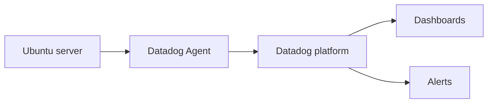

# Datadog for DevOps — Beginner Guide

Welcome to the **Datadog** section.

Datadog is an observability platform used to monitor servers, applications, logs, containers, and cloud services from one place.

In this guide, students will install the Datadog Agent on Ubuntu, monitor the server, collect Nginx metrics and logs, create a dashboard, and configure an alert.

> **Security warning:** Never publish a Datadog API key. If a key has been committed to GitHub, revoke it immediately. Removing it only from the current README does not remove it from Git history.

---

## What Students Will Learn

- What monitoring and observability mean
- What metrics, logs, and traces are
- How the Datadog Agent works
- How to install and verify the Agent on Ubuntu
- How to add useful tags
- How to monitor Nginx and collect its logs
- How to create a dashboard and monitor
- How to solve common problems

---

## 1. Monitoring and Observability

**Monitoring** means continuously checking the health and performance of a system.

Examples:

- Is the server running?
- Is CPU usage high?
- Is the disk becoming full?
- Is the website responding?
- Are errors increasing?

**Observability** helps us understand why a problem is happening.

Datadog mainly works with:

| Data | Meaning | Example |
|---|---|---|
| Metrics | Numeric values collected over time | CPU, memory, request count |
| Logs | Records of events | Nginx access log, application error |
| Traces | Journey of a request through services | Frontend → API → database |

```text
Metrics tell us something is wrong.
Logs help explain what happened.
Traces show where a request became slow or failed.
```

---

## 2. How Datadog Works



The **Datadog Agent** is installed on the server. It collects monitoring data and sends it to the correct Datadog site.

It can collect:

- CPU, memory, disk, and network metrics
- Service information
- Logs
- Nginx, Docker, database, and other integration data
- Application traces when APM is configured

---

## 3. API Key and Datadog Site

### API Key

The API key connects data from the Agent to your Datadog organization.

Never place it in:

- GitHub
- A README
- Source code
- Dockerfiles
- Screenshots
- Public terminal output

### Datadog Site

Datadog has different regional sites, such as:

```text
datadoghq.com
us3.datadoghq.com
us5.datadoghq.com
datadoghq.eu
ap1.datadoghq.com
```

Use the site displayed in your own Datadog account. If the site is wrong, data may not reach the expected organization.

---

## 4. Lab Requirements

Students need:

- A Datadog account
- One Ubuntu machine or EC2 instance
- SSH access
- `sudo` permission
- Internet access from the server

If using AWS:

- Allow SSH only from your trusted IP address.
- Do not open Datadog Agent ports to the internet.
- Stop or terminate the instance after practice.
- Check AWS and Datadog usage to avoid charges.

---

## 5. Create a Datadog Account

1. Open the [Datadog website](https://www.datadoghq.com/).
2. Create a trial or learning account.
3. Verify your email.
4. Sign in.
5. Note the Datadog site shown in the browser address.

Do not share your password or keys with other students.

---

## 6. Install the Datadog Agent on Ubuntu

### Step 1 — Connect to Ubuntu

```bash
ssh -i your-key.pem ubuntu@your-server-ip
```

Replace the example values with your own key and address.

### Step 2 — Update Ubuntu

```bash
sudo apt update
sudo apt upgrade -y
```

### Step 3 — Get the Official Command

Inside Datadog:

1. Open **Integrations**.
2. Open **Agent** or **Install Agent**.
3. Select **Ubuntu**.
4. Select the correct Datadog site.
5. Copy the command generated for your organization.

It normally looks similar to:

```bash
DD_API_KEY="<your-api-key>" \
DD_SITE="<your-datadog-site>" \
bash -c "$(curl -L https://install.datadoghq.com/scripts/install_script_agent7.sh)"
```

Use the current command generated by Datadog. Never copy another person's API key or a key from a public repository.

> Confirm that the installation URL matches the current official Datadog documentation before running an internet-delivered script.

### Step 4 — Check the Service

```bash
sudo systemctl status datadog-agent
```

Press `q` to exit the status screen.

### Step 5 — Check the Agent

```bash
sudo datadog-agent status
```

### Step 6 — Find the Host in Datadog

1. Return to Datadog.
2. Open **Infrastructure**.
3. Open **Host Map** or **Infrastructure List**.
4. Wait a few minutes if the host is not immediately visible.
5. Open the host and inspect CPU, memory, disk, and network data.

---

## 7. Useful Agent Commands

| Purpose | Command |
|---|---|
| Check service | `sudo systemctl status datadog-agent` |
| Start Agent | `sudo systemctl start datadog-agent` |
| Stop Agent | `sudo systemctl stop datadog-agent` |
| Restart Agent | `sudo systemctl restart datadog-agent` |
| Enable at startup | `sudo systemctl enable datadog-agent` |
| Agent information | `sudo datadog-agent status` |
| Validate configuration | `sudo datadog-agent configcheck` |
| Run diagnostics | `sudo datadog-agent diagnose` |
| View recent logs | `sudo journalctl -u datadog-agent --since "30 minutes ago"` |

Important Linux locations:

```text
/etc/datadog-agent/datadog.yaml
/etc/datadog-agent/conf.d/
/var/log/datadog/
```

---

## 8. Add Tags

Tags help organize and filter monitoring data.

Edit the Agent configuration:

```bash
sudo nano /etc/datadog-agent/datadog.yaml
```

Find or add:

```yaml
tags:
  - env:dev
  - team:cdec
  - role:web
```

Validate and restart:

```bash
sudo datadog-agent configcheck
sudo systemctl restart datadog-agent
sudo datadog-agent status
```

Common tags:

| Tag | Example | Purpose |
|---|---|---|
| `env` | `env:dev` | Environment |
| `service` | `service:student-app` | Application or service |
| `version` | `version:1.0.0` | Deployed version |
| `team` | `team:cdec` | Responsible team |
| `role` | `role:web` | Server responsibility |

Use the same `env`, `service`, and `version` values across related metrics, logs, and traces. Never use passwords, tokens, or personal information as tags.

---

## 9. Monitor Nginx

### Step 1 — Install Nginx

```bash
sudo apt update
sudo apt install nginx -y
sudo systemctl enable nginx
sudo systemctl start nginx
sudo systemctl status nginx
```

Open the server IP in a browser and confirm that the Nginx page appears.

### Step 2 — Enable the Nginx Status Page

```bash
sudo nano /etc/nginx/conf.d/status.conf
```

Add:

```nginx
server {
    listen 127.0.0.1:8080;
    server_name localhost;

    location /nginx_status {
        stub_status;
        allow 127.0.0.1;
        deny all;
    }
}
```

Test and reload:

```bash
sudo nginx -t
sudo systemctl reload nginx
curl http://127.0.0.1:8080/nginx_status
```

The status page listens only on localhost.

### Step 3 — Configure the Datadog Integration

```bash
sudo cp \
  /etc/datadog-agent/conf.d/nginx.d/conf.yaml.example \
  /etc/datadog-agent/conf.d/nginx.d/conf.yaml
```

Edit it:

```bash
sudo nano /etc/datadog-agent/conf.d/nginx.d/conf.yaml
```

Use:

```yaml
init_config:

instances:
  - nginx_status_url: http://127.0.0.1:8080/nginx_status
    tags:
      - env:dev
      - service:student-nginx
```

Validate and test:

```bash
sudo datadog-agent configcheck
sudo systemctl restart datadog-agent
sudo datadog-agent check nginx
```

Generate requests:

```bash
curl http://127.0.0.1/
curl http://127.0.0.1/
curl http://127.0.0.1/not-found
```

Open the Nginx integration in Datadog and view its metrics.

> If the installed example uses different fields, follow that file and the current official integration documentation.

---

## 10. Collect Nginx Logs

### Step 1 — Enable Logs

Edit:

```bash
sudo nano /etc/datadog-agent/datadog.yaml
```

Set:

```yaml
logs_enabled: true
```

### Step 2 — Configure Log Files

Edit:

```bash
sudo nano /etc/datadog-agent/conf.d/nginx.d/conf.yaml
```

Keep the existing `instances` section and add:

```yaml
logs:
  - type: file
    path: /var/log/nginx/access.log
    source: nginx
    service: student-nginx
    tags:
      - env:dev

  - type: file
    path: /var/log/nginx/error.log
    source: nginx
    service: student-nginx
    tags:
      - env:dev
```

### Step 3 — Restart and Test

```bash
sudo datadog-agent configcheck
sudo systemctl restart datadog-agent
sudo datadog-agent status
curl http://127.0.0.1/
curl http://127.0.0.1/not-found
```

Inside Datadog:

1. Open **Logs → Explorer**.
2. Search:

```text
service:student-nginx env:dev
```

If logs do not appear, check file permissions and Agent status. Never use `chmod 777` on log files.

---

## 11. Create a Dashboard

1. Open **Dashboards**.
2. Select **New Dashboard**.
3. Name it `CDEC Ubuntu Monitoring`.
4. Add widgets for:

   - CPU usage
   - Memory usage
   - Disk usage
   - Network traffic
   - Nginx requests or connections
   - Nginx error logs

5. Add an `env` or `host` filter.
6. Save the dashboard.

A useful dashboard answers clear questions. It does not need every available metric.

---

## 12. Create a CPU Alert

1. Open **Monitors**.
2. Select **New Monitor → Metric**.
3. Select a system CPU metric.
4. Filter it to the lab host or `env:dev`.
5. Set a suitable learning threshold and evaluation period.
6. Add a clear notification message.
7. Send a test notification if available.
8. Save the monitor.

Example message:

```text
High CPU usage detected on the Ubuntu lab server.

Environment: dev
Impact: The application may become slow.
First actions:
1. Check running processes.
2. Check recent traffic.
3. Check deployments.
4. Compare memory and disk usage.
```

A good alert explains what happened, which system is affected, why it matters, and what to check first.

---

## 13. Optional Custom Metric

DogStatsD is included with the Datadog Agent and accepts application metrics.

```bash
sudo apt install netcat-openbsd -y
printf 'cdec.lab.request:1|c|#env:dev,service:student-app' \
  | nc -u -w 1 127.0.0.1 8125
```

Search for:

```text
cdec.lab.request
```

Do not use unique user IDs, request IDs, random values, or timestamps as metric tags. Too many unique tag combinations can increase custom metric usage and cost.

---

## 14. Basic APM Understanding

APM means **Application Performance Monitoring**. It helps identify slow APIs, failed services, and slow database operations.

```text
User request
     ↓
Frontend
     ↓
Backend API
     ↓
Database
```

The complete request is a **trace**. Each operation inside it is a **span**.

APM setup differs for Node.js, Java, Python, .NET, and other languages. Follow the current language-specific Datadog guide after completing the Agent labs.

---

## 15. Troubleshooting

### Agent Is Not Running

```bash
sudo systemctl status datadog-agent
sudo journalctl -u datadog-agent --since "30 minutes ago"
sudo systemctl restart datadog-agent
```

### Host Is Not Visible

Check:

- Agent is running
- API key is valid
- Datadog site is correct
- Server has internet access
- Outbound HTTPS is allowed
- Server clock is correct

```bash
sudo datadog-agent status
sudo datadog-agent diagnose
```

Never print the API key while debugging.

### Configuration Error

```bash
sudo datadog-agent configcheck
```

Use spaces, not tabs, in YAML.

### Nginx Metrics Are Missing

```bash
sudo nginx -t
curl http://127.0.0.1:8080/nginx_status
sudo datadog-agent check nginx
```

### Logs Are Missing

Check:

- `logs_enabled: true`
- Correct file paths
- Agent read permissions
- YAML configuration
- Log Explorer time range
- `service` and `env` filters

Never use `chmod 777` as a permission fix.

### API Key Was Exposed

1. Revoke the key immediately.
2. Generate a replacement.
3. Update the Agent securely.
4. Remove the key from the current file.
5. Remove it from Git history using an approved process.
6. Review usage for unexpected activity.

---

## 16. Security and Cost Rules

- Never commit API or Application keys.
- Restrict SSH to trusted addresses.
- Do not expose Agent ports publicly.
- Do not collect passwords, tokens, or personal data in logs.
- Avoid unique values as metric tags.
- Control log collection and retention.
- Check current pricing before enabling additional products.
- Stop cloud servers after the lab.

---

## 17. Student Practice

### Practice 1 — Agent

Install the Agent, verify it, and find the Ubuntu host in Datadog.

### Practice 2 — Tags

Add `env:dev`, `team:cdec`, and `role:web`. Restart the Agent and filter the host using those tags.

### Practice 3 — Nginx

Install Nginx, configure its local status page, and view Nginx metrics.

### Practice 4 — Logs

Collect Nginx access and error logs. Generate successful and failed requests and find them in Log Explorer.

### Practice 5 — Dashboard and Alert

Create a dashboard containing system and Nginx data. Create and test one CPU alert.

---

## 18. Student Assignment

Monitor one Ubuntu web server using Datadog.

Include:

- Agent installation
- CPU, memory, disk, and network monitoring
- Host tags
- Nginx integration
- Nginx logs
- One dashboard
- One alert
- Troubleshooting notes
- Cleanup steps

Students may submit sanitized screenshots and example configurations. They must not submit API keys, passwords, private keys, or sensitive logs.

---

## 19. Interview Questions

1. What is Datadog?
2. What is monitoring?
3. What are metrics, logs, and traces?
4. What does the Datadog Agent do?
5. What is an API key?
6. Why is the Datadog site important?
7. What are tags?
8. What do `env`, `service`, and `version` mean?
9. What is a Datadog integration?
10. How do you check Agent status?
11. Why might a host not appear?
12. How do you enable logs?
13. What is DogStatsD?
14. What is APM?
15. What is the difference between a dashboard and a monitor?
16. Why must keys stay out of Git?

---

## Official References

- [Getting Started with the Agent](https://docs.datadoghq.com/getting_started/agent/)
- [Agent commands](https://docs.datadoghq.com/agent/configuration/agent-commands/)
- [Datadog sites](https://docs.datadoghq.com/getting_started/site/)
- [API and Application keys](https://docs.datadoghq.com/account_management/api-app-keys/)
- [Tags](https://docs.datadoghq.com/getting_started/tagging/)
- [Host log collection](https://docs.datadoghq.com/agent/logs/)
- [Custom metrics](https://docs.datadoghq.com/metrics/custom_metrics/)
- [Getting Started with APM](https://docs.datadoghq.com/getting_started/tracing/)

---

## Learning Path

```text
Datadog fundamentals
        ↓
Install Agent
        ↓
Monitor Ubuntu
        ↓
Add tags
        ↓
Monitor Nginx
        ↓
Collect logs
        ↓
Create dashboard and alert
```

Start with one server and one service. Understand the data first, then gradually learn advanced monitoring.
