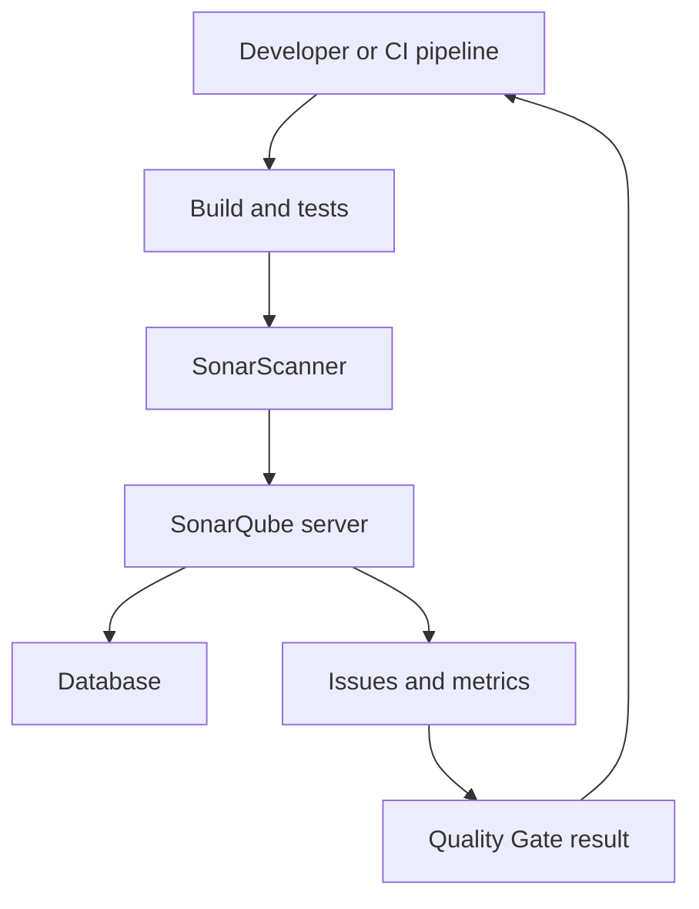
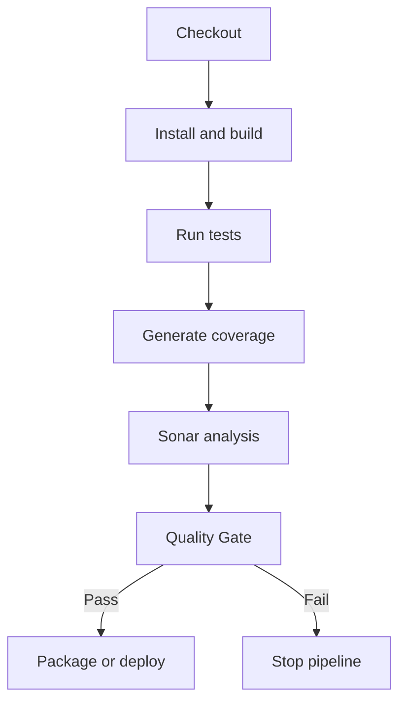

# SonarQube for DevOps — Student Guide

Welcome to the **SonarQube** section of the CDEC DevOps Learning repository.

SonarQube is a self-managed platform for continuously inspecting source code quality and security. It analyzes code, presents issues and metrics, and can stop a CI/CD pipeline when a project does not meet its Quality Gate.

This guide uses **SonarQube Community Build** for learning. Features vary by product, edition, language, and version, so always confirm the current official documentation before designing a production solution.

> **Important:** Run the labs on a local machine or disposable server. Do not expose a learning instance directly to the public internet, and never commit authentication tokens.

---

## Learning Outcomes

After completing this section, students should be able to:

- Explain static code analysis and SonarQube architecture
- Distinguish reliability, security, maintainability, duplication, and coverage metrics
- Explain the difference between a Quality Profile and a Quality Gate
- Run SonarQube Community Build safely for a local lab
- Create a project and generate a scoped analysis token
- Analyze JavaScript/TypeScript and Java projects
- Import test coverage generated by external tools
- Integrate SonarQube with Jenkins
- Fail a pipeline when the Quality Gate fails
- Investigate common scanner, coverage, webhook, and permission errors
- Describe production requirements and security practices

---

## 1. Why Code Quality Automation Matters

Code can compile and still contain defects, security problems, duplicated logic, or maintainability issues. Manual review is essential, but reviewers may not consistently detect every repeated pattern across a large codebase.

Static analysis helps teams automatically inspect code without executing the application. It provides repeatable feedback during development and CI/CD.

SonarQube can help teams:

- Detect reliability problems
- Identify security vulnerabilities and security-sensitive code
- Find maintainability issues
- Measure duplicated code
- Display imported test coverage
- Apply shared coding rules
- Enforce a Quality Gate in CI/CD
- Focus reviews on problems introduced in new code

SonarQube supports engineering decisions; it does not replace developers, tests, code review, threat modeling, dependency scanning, or runtime security testing.

---

## 2. Static Analysis vs Dynamic Testing

| Method | Examines | Application running? | Example |
|---|---|---:|---|
| Static analysis | Source or compiled code | No | SonarQube analysis |
| Unit testing | Small units of behavior | Yes | Jest, JUnit |
| Integration testing | Interactions between components | Yes | API and database tests |
| Dynamic security testing | Running application behavior | Yes | Web application scanner |
| Dependency scanning | Third-party packages | No/varies | Known vulnerable library detection |

A mature pipeline combines several methods because each one finds different types of problems.

---

## 3. SonarQube Architecture



### Main Components

| Component | Responsibility |
|---|---|
| SonarQube server | Processes analysis, applies rules, and provides the web interface and API |
| Database | Stores configuration, project information, analysis history, and results |
| Scanner | Examines a project and submits an analysis report to the server |
| Compute Engine | Processes submitted analysis reports in the background |
| Search engine | Powers search and issue exploration inside SonarQube |
| CI/CD system | Builds, tests, invokes analysis, and enforces the Quality Gate |

The scanner and server are separate. Running a server does not automatically analyze every repository; a scanner or supported CI integration must submit an analysis.

---

## 4. Core Concepts

### Reliability

Reliability issues represent code that may behave incorrectly or unexpectedly.

Examples:

- Incorrect conditions
- Resources that are not closed
- Possible null access
- Logic that can produce the wrong result

### Security

Security issues represent code patterns that may expose the application to attack.

Examples:

- Hard-coded credentials
- Unsafe input handling
- Weak cryptographic practices
- Injection risks

### Security Hotspots

A security hotspot is security-sensitive code that requires human review. A hotspot is not automatically a confirmed vulnerability.

Examples:

- Cryptographic configuration
- Authentication-related code
- CORS or cookie settings
- Use of security-sensitive APIs

### Maintainability

Maintainability issues make code more difficult to understand, test, or change.

Examples:

- Very complex functions
- Deep nesting
- Unused code
- Confusing naming
- Repeated implementation patterns

### Duplications

Duplicated blocks can make maintenance harder because the same correction may need to be applied in multiple locations.

### Test Coverage

Coverage indicates how much code was exercised by tests. SonarQube **does not generate coverage**. A test/coverage tool such as Jest, JaCoCo, Coverage.py, or another supported tool must create a report, and the scanner imports it.

High coverage does not prove that tests are correct, meaningful, or complete.

---

## 5. Rules, Quality Profiles, and Quality Gates

These concepts are related but not interchangeable.

| Concept | Question answered |
|---|---|
| Rule | What coding pattern should be checked? |
| Quality Profile | Which rules apply to a language? |
| Measure | What value was calculated, such as coverage? |
| Quality Gate | Is the analyzed code acceptable? |

### Quality Profile

A Quality Profile is a set of active analysis rules for a programming language. A Java project may use one profile for Java, while its JavaScript files use a JavaScript profile.

### Quality Gate

A Quality Gate contains pass/fail conditions. Teams commonly evaluate conditions on **new code** so that newly introduced code meets the agreed standard.

Possible conditions include:

- No new reliability issues above an agreed severity
- No new security issues above an agreed severity
- Required review of new security hotspots
- Minimum coverage on new code
- Maximum duplicated lines on new code

Do not create arbitrary thresholds only to display a green result. Agree on standards with the team and improve them gradually.

---

## 6. Clean as You Code

The Clean as You Code approach focuses on the code being added or changed now. Existing technical debt remains visible, but it does not need to be fixed in one risky, unrelated change.

A practical workflow is:

1. Define what counts as new code.
2. Analyze every important change.
3. Require new code to pass the Quality Gate.
4. Fix or review issues before merging.
5. Improve older code when it is modified or through planned refactoring.

This prevents the codebase from getting worse while allowing controlled improvement.

---

## 7. Local Lab with Docker

The following setup is for learning and evaluation. The embedded database used by a simple container is not suitable for production.

### Prerequisites

- A supported Docker Engine and Docker Compose installation
- Sufficient RAM, CPU, and disk space
- Port `9000` available locally
- Required Linux host settings from the current SonarQube installation documentation

Confirm Docker:

```bash
docker --version
docker compose version
```

### Create `compose.yml`

```yaml
services:
  sonarqube:
    image: sonarqube:community
    container_name: sonarqube-lab
    ports:
      - "127.0.0.1:9000:9000"
    volumes:
      - sonarqube_data:/opt/sonarqube/data
      - sonarqube_logs:/opt/sonarqube/logs
      - sonarqube_extensions:/opt/sonarqube/extensions
    restart: unless-stopped

volumes:
  sonarqube_data:
  sonarqube_logs:
  sonarqube_extensions:
```

Binding to `127.0.0.1` keeps this local lab from listening on every network interface.

> For reproducible environments, replace the moving `community` tag with a reviewed, supported version tag. Test upgrades before changing the pinned version.

Start the service:

```bash
docker compose up -d
docker compose ps
docker compose logs -f sonarqube
```

Wait until the logs indicate that the service is operational, then open:

```text
http://localhost:9000
```

For a new lab installation, follow the sign-in instructions shown by the current image and change any initial administrator password immediately.

Stop the lab without deleting its volumes:

```bash
docker compose down
```

Delete the lab data only when you intentionally want a fresh environment:

```bash
docker compose down --volumes
```

The second command permanently removes the Compose-managed SonarQube lab volumes.

---

## 8. Production Deployment Principles

A learning container is not a production architecture. A production deployment should include:

- A supported external database rather than embedded H2
- A supported SonarQube release and documented upgrade path
- Persistent, backed-up data
- TLS through a correctly configured reverse proxy or platform ingress
- Restricted network access
- Central authentication where appropriate
- Least-privilege users, groups, and project permissions
- Secure CI secrets and token rotation
- Monitoring, alerting, and log retention
- Tested backup and restore procedures
- Capacity planning and the required operating-system settings
- A staging environment for update testing

Do not copy a lab Compose file directly into production.

---

## 9. Create a Project and Token

The interface can differ by version, but the typical learning flow is:

1. Sign in to SonarQube.
2. Create a local project.
3. Choose a unique project key, for example `student-node-app`.
4. Generate a **project analysis token** when available.
5. Copy the token once and store it in a secret manager or CI credential store.

For a local terminal session, use an environment variable:

```bash
export SONAR_TOKEN="replace-with-your-token"
export SONAR_HOST_URL="http://localhost:9000"
```

Do not place the token in:

- `sonar-project.properties`
- Source code
- A Dockerfile
- Shell history
- Screenshots
- Jenkinsfiles committed to Git
- Public CI logs

Revoke and replace a token immediately if it is exposed.

---

## 10. Scanner Options

Choose the scanner designed for the build system or language.

| Project type | Common scanner approach |
|---|---|
| Maven | SonarScanner for Maven |
| Gradle | SonarScanner for Gradle |
| .NET | SonarScanner for .NET |
| General CLI project | SonarScanner CLI |
| Supported JavaScript/TypeScript workflow | Scanner supported by the current SonarQube documentation |
| CI platform | Officially supported CI integration/action/plugin |

Use the current scanner documentation because runtime requirements and recommended commands change between releases.

---

## 11. Analysis Parameters

For a simple CLI project, create `sonar-project.properties` in the project root:

```properties
sonar.projectKey=student-node-app
sonar.projectName=Student Node App
sonar.sources=src
sonar.tests=test
sonar.sourceEncoding=UTF-8
sonar.javascript.lcov.reportPaths=coverage/lcov.info
```

Do not add `sonar.token` to this file.

Common parameters:

| Parameter | Purpose |
|---|---|
| `sonar.projectKey` | Unique project identifier |
| `sonar.projectName` | Display name |
| `sonar.sources` | Source-code location |
| `sonar.tests` | Test-code location |
| `sonar.sourceEncoding` | Source encoding |
| Coverage report path | Language/tool-specific report location |
| `sonar.exclusions` | Files intentionally excluded from source analysis |
| `sonar.coverage.exclusions` | Files excluded only from coverage calculation |

Avoid broad exclusions that hide real application code. Document every exclusion and its reason.

---

## 12. JavaScript/TypeScript Lab with Jest

Example structure:

```text
student-node-app/
├── src/
│   └── calculator.js
├── test/
│   └── calculator.test.js
├── coverage/
├── package.json
└── sonar-project.properties
```

Example `src/calculator.js`:

```javascript
function add(a, b) {
  return a + b;
}

function divide(a, b) {
  if (b === 0) {
    throw new Error('Division by zero');
  }
  return a / b;
}

module.exports = { add, divide };
```

Example `test/calculator.test.js`:

```javascript
const { add, divide } = require('../src/calculator');

test('adds two numbers', () => {
  expect(add(2, 3)).toBe(5);
});

test('divides two numbers', () => {
  expect(divide(10, 2)).toBe(5);
});

test('rejects division by zero', () => {
  expect(() => divide(10, 0)).toThrow('Division by zero');
});
```

Install and run Jest with coverage:

```bash
npm install
npm test -- --coverage
test -f coverage/lcov.info
```

Run the scanner using the installation method recommended for your current scanner version. A typical CLI invocation is:

```bash
sonar-scanner \
  -Dsonar.host.url="$SONAR_HOST_URL" \
  -Dsonar.token="$SONAR_TOKEN"
```

The order matters:

```text
Install dependencies
        ↓
Run tests and create coverage report
        ↓
Run Sonar analysis
        ↓
Wait for server processing
        ↓
Evaluate Quality Gate
```

If the test tool does not generate `coverage/lcov.info`, SonarQube cannot import it.

---

## 13. Java Lab with Maven and JaCoCo

For a Maven project, configure JaCoCo to generate its XML report during the build. The exact plugin version should be reviewed and pinned in the project.

Typical command flow:

```bash
mvn clean verify
mvn sonar:sonar \
  -Dsonar.projectKey=student-java-app \
  -Dsonar.host.url="$SONAR_HOST_URL" \
  -Dsonar.token="$SONAR_TOKEN"
```

The `verify` phase should run the tests and generate the JaCoCo XML report before analysis. Confirm the current Java coverage documentation and the report location used by your build.

Do not use `-DskipTests` in a coverage lab. Skipping tests means there is no new test execution from which to produce meaningful coverage.

---

## 14. Reading the Project Dashboard

After analysis processing finishes, review:

- Quality Gate status
- Reliability findings
- Security findings
- Security hotspots requiring review
- Maintainability findings
- Coverage
- Duplications
- New code versus overall code
- Analysis history

### Investigating an Issue

For each issue:

1. Read the rule description.
2. Inspect the exact code context.
3. Decide whether the finding is valid.
4. Correct the root cause, not merely the displayed line.
5. Run tests.
6. Analyze again.
7. Document any reviewed disposition according to team policy.

Never change a Quality Profile, exclusion, or issue status only to make the dashboard green.

---

## 15. SonarQube in Jenkins

### Required Jenkins Configuration

Typical requirements include:

- A reachable SonarQube server
- The appropriate Jenkins SonarQube integration plugin
- A SonarQube token stored as a Jenkins **Secret text** credential
- A configured SonarQube server entry in Jenkins
- The appropriate scanner/build tool on the Jenkins agent
- A SonarQube webhook for reliable Quality Gate waiting

Menu labels vary by Jenkins and plugin version. Common locations are:

```text
Manage Jenkins → Plugins
Manage Jenkins → Credentials
Manage Jenkins → System
Manage Jenkins → Tools
```

Store the token in Jenkins Credentials, not directly in the Jenkinsfile.

### Pipeline Flow



### Declarative Jenkins Pipeline — Maven Example

Replace tool and server names with the exact names configured in your Jenkins instance.

```groovy
pipeline {
    agent any

    tools {
        jdk 'jdk17'
        maven 'maven3'
    }

    stages {
        stage('Checkout') {
            steps {
                checkout scm
            }
        }

        stage('Build and Test') {
            steps {
                sh 'mvn clean verify'
            }
        }

        stage('SonarQube Analysis') {
            steps {
                withSonarQubeEnv('sonarqube-server') {
                    sh '''
                        mvn sonar:sonar \
                          -Dsonar.projectKey=student-java-app
                    '''
                }
            }
        }

        stage('Quality Gate') {
            steps {
                timeout(time: 10, unit: 'MINUTES') {
                    waitForQualityGate abortPipeline: true
                }
            }
        }
    }

    post {
        always {
            junit allowEmptyResults: true,
                  testResults: '**/target/surefire-reports/*.xml'
        }
    }
}
```

Important details:

- `withSonarQubeEnv` injects the configured server details and credentials.
- `waitForQualityGate` waits for server-side analysis processing.
- `abortPipeline: true` stops later stages when the gate fails.
- A timeout prevents a pipeline from waiting forever.
- The SonarQube webhook must reach Jenkins for the recommended pipeline-pause flow.
- Build and test failure should stop analysis or deployment rather than be ignored.

Do not place deployment before the Quality Gate stage.

---

## 16. Quality Gate Lab

1. Analyze a small project successfully.
2. Review the default Quality Gate.
3. With instructor approval, create or assign a training Quality Gate.
4. Add a realistic condition on new code.
5. Introduce a controlled issue in a lab branch.
6. Run analysis and observe the failed gate.
7. Correct the issue and run analysis again.
8. Confirm that the gate passes.

The objective is to understand enforcement, not to create artificial metrics.

---

## 17. Pull Request and Branch Analysis

Some branch and pull-request capabilities depend on the SonarQube product or edition and the DevOps platform integration. Do not promise a feature until you confirm that it is supported by the installed product.

Where supported, pull-request analysis helps teams:

- See issues introduced by the proposed change
- Display Quality Gate results during review
- Prevent merging when required checks fail
- Give developers feedback before code reaches the main branch

Protect the main branch in the source-control platform and require the agreed CI checks according to team policy.

---

## 18. Security Practices

- Use scoped project analysis tokens when possible.
- Store tokens in CI credential storage or a secrets manager.
- Mask secrets in logs and rotate exposed tokens.
- Use TLS for non-local traffic.
- Restrict server, database, administration, and webhook access.
- Apply least privilege to users, groups, projects, and automation accounts.
- Change default credentials immediately.
- Review third-party plugins before installation.
- Keep SonarQube, scanners, plugins, and the database on supported versions.
- Back up the database and required persistent data using documented procedures.
- Test restore and upgrade procedures.
- Do not analyze repositories that the scanning account is not authorized to access.
- Treat source code and analysis findings as sensitive organizational data.

### Unsafe Examples

```groovy
// Never commit a real token
sh 'sonar-scanner -Dsonar.token=<exposed-token>'
```

```properties
# Never save a real token here
sonar.token=<exposed-token>
```

Use a protected environment variable or CI credential binding instead.

---

## 19. Troubleshooting

### SonarQube Container Is Not Ready

```bash
docker compose ps
docker compose logs sonarqube
docker stats sonarqube-lab
```

Check:

- Available memory and disk space
- Required Linux host settings
- Port conflicts
- Volume permissions
- Container health and startup logs
- Whether the selected image supports the host architecture

Do not repeatedly restart the service without reading the logs.

### Scanner Cannot Connect

Check:

```bash
curl -I "$SONAR_HOST_URL"
```

Possible causes:

- Incorrect `SONAR_HOST_URL`
- DNS, firewall, proxy, or routing problem
- SonarQube still starting
- CI container using `localhost` when SonarQube is on another host
- TLS certificate trust problem

Remember: inside a container, `localhost` refers to that container itself.

### `Not authorized` or `Insufficient privileges`

Check:

- Token is present and not expired/revoked
- Token belongs to the intended account or project
- Account has Execute Analysis permission
- Project key is correct
- CI secret binding is configured

Do not print the token to debug the problem.

### Project Key Error

Use one stable, unique project key and ensure it matches the SonarQube project and CI configuration.

### Coverage Is Zero or Missing

Check in this order:

1. Did tests run?
2. Did the coverage tool create a report?
3. Is the report format supported?
4. Does the report path match the scanner configuration?
5. Are source paths inside the report compatible with the checked-out workspace?
6. Did analysis run after report generation?

Example:

```bash
find . -type f \( -name 'lcov.info' -o -name 'jacoco.xml' \)
```

### Analysis Succeeds but Quality Gate Waits Forever

Check:

- SonarQube webhook URL and secret
- Network route from SonarQube to Jenkins
- Jenkins endpoint accessibility
- Pipeline timeout
- Background task status in SonarQube
- Jenkins and SonarQube logs

Do not remove Quality Gate enforcement simply to avoid diagnosing the webhook.

### Source Files Are Missing

Check `sonar.sources`, exclusions, working directory, checkout stage, and generated-source behavior. Avoid using `sonar.sources=.` without understanding what will be included.

### Too Many False or Irrelevant Findings

- Read the rule documentation.
- Confirm the language and framework context.
- Review the issue with a developer or security specialist.
- Tune a Quality Profile through an approved team process.
- Document exceptions instead of hiding broad paths.

---

## 20. Recommended Repository Structure

```text
student-application/
├── src/
├── test/
├── pom.xml or package.json
├── sonar-project.properties
├── Jenkinsfile
├── compose.yml
├── .gitignore
└── README.md
```

Example `.gitignore` additions:

```gitignore
node_modules/
coverage/
target/
.scannerwork/
.env
*.log
```

Whether coverage and build reports are committed depends on project policy; normally they are generated during CI rather than stored in source control.

---

## 21. Hands-On Labs

### Lab 1 — Run SonarQube Locally

1. Start SonarQube Community Build with Docker Compose.
2. Bind the lab to localhost.
3. Sign in and change the initial administrator password.
4. Explore projects, rules, profiles, gates, and administration areas.
5. Stop the container without deleting its volumes.

### Lab 2 — Analyze a JavaScript Project

1. Create a small Node.js project.
2. Add Jest unit tests.
3. Generate `coverage/lcov.info`.
4. Configure a unique project key.
5. Store the token outside Git.
6. Run analysis and inspect the dashboard.

### Lab 3 — Investigate and Fix Issues

1. Select one maintainability or reliability issue.
2. Read its rule documentation.
3. Correct the root cause.
4. Run tests and analysis again.
5. Compare the two analysis results.

### Lab 4 — Quality Gate

1. Define a training condition on new code.
2. Make a controlled change that fails it.
3. Observe the failed result.
4. Correct the code.
5. Confirm the next analysis passes.

### Lab 5 — Jenkins Integration

1. Store the SonarQube token as a Jenkins credential.
2. Configure the SonarQube server entry.
3. Configure the webhook.
4. Run build, test, coverage, and analysis stages.
5. Add a Quality Gate stage before packaging or deployment.

---

## 22. Student Assignment — Quality Gate Pipeline

Build a CI pipeline for a small Java, JavaScript, TypeScript, Python, or .NET application.

Requirements:

- Application source code and meaningful unit tests
- A test report and supported coverage report
- A unique SonarQube project key
- No token or password committed to Git
- Build and test stages before analysis
- SonarQube analysis stage
- Quality Gate enforcement before packaging or deployment
- At least one investigated and corrected issue
- A documented example of one reliability, security, or maintainability rule
- A comparison of overall code and new-code results
- Cleanup instructions for all lab resources

### Submission Evidence

Students should provide:

- Repository structure
- Sanitized `sonar-project.properties` or build configuration
- CI pipeline file
- Test and coverage commands
- SonarQube project overview screenshot without secrets
- Evidence of one failed and one successful Quality Gate
- Explanation of the corrected issue
- Short troubleshooting note

Do not submit tokens, passwords, internal hostnames, private source code, or sensitive server logs.

---

## 23. Interview Questions

1. What is static code analysis?
2. What problem does SonarQube solve?
3. What is the difference between the SonarQube server and a scanner?
4. What are reliability, security, and maintainability issues?
5. What is a security hotspot?
6. What is the difference between a Quality Profile and a Quality Gate?
7. What is Clean as You Code?
8. Does SonarQube generate test coverage?
9. Why must tests run before Sonar analysis?
10. What is the purpose of `sonar.projectKey`?
11. Why should a token not be stored in `sonar-project.properties`?
12. How does Jenkins receive a Quality Gate result?
13. Why should deployment occur after the Quality Gate?
14. Why is embedded H2 unsuitable for production?
15. What could cause coverage to display as zero?
16. What is the difference between overall code and new code?
17. How should a team handle a suspected false positive?
18. Why is high coverage not proof of good tests?
19. Which security practices are required for a production SonarQube server?
20. How would you troubleshoot a pipeline waiting indefinitely for a gate result?

---

## Official References

- [SonarQube Server documentation](https://docs.sonarsource.com/sonarqube-server/)
- [Installing from a Docker image](https://docs.sonarsource.com/sonarqube-server/server-installation/from-docker-image/installation-overview)
- [Installing the database](https://docs.sonarsource.com/sonarqube-server/server-installation/installing-the-database)
- [Managing tokens](https://docs.sonarsource.com/sonarqube-server/user-guide/managing-tokens)
- [Understanding Quality Gates](https://docs.sonarsource.com/sonarqube-server/quality-standards-administration/managing-quality-gates/introduction-to-quality-gates)
- [Test coverage overview](https://docs.sonarsource.com/sonarqube-server/analyzing-source-code/test-coverage/overview)
- [Test coverage parameters](https://docs.sonarsource.com/sonarqube-server/analyzing-source-code/test-coverage/test-coverage-parameters)
- [Jenkins pipeline pause](https://docs.sonarsource.com/sonarqube-server/analyzing-source-code/ci-integration/jenkins-integration/pipeline-pause)
- [Official SonarQube Docker image](https://hub.docker.com/_/sonarqube)

---

## Next Step

```text
Static analysis fundamentals
        ↓
Local SonarQube lab
        ↓
Scanner and project analysis
        ↓
Tests and coverage import
        ↓
Quality Profiles and Quality Gates
        ↓
Jenkins integration
        ↓
Secure quality-gated CI/CD pipeline
```

Treat SonarQube findings as engineering feedback: understand the rule, examine the context, correct the root cause, and verify the result with tests and a new analysis.
